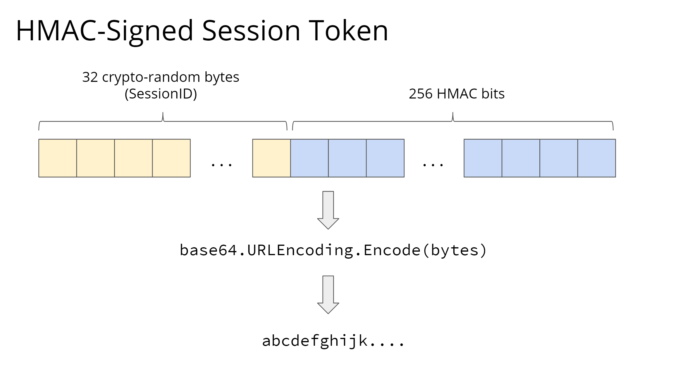

# Session ID Token

An utility library for generating **digitally signed** and **base64 encoded** session token based on **cryptographically random** session ID

## What Is a Session Token?

A session token is just a string, but there are two common options for what this string should contain and how it should be formatted

### JSON Web Token (JWT)

JWT is a JSON object containing several fields that are digitally-signed, base64-encoded, and optionally encrypted if the embedded data contains sensitive information. It embeds all **session state data** into the token itself. If you have the token, you can [decode](https://jwt.io/) it to get the data

Pros:

- No need for a shared session store

Cons:

- Irrevocable: since there is no shared session store on the server-side, we can't revoke it
- Much larger on the wire: since JWT embeds all of the session state data, as opposed to just a session ID, they are noticeably larger. This adds size overhead to every request
- Must be encrypted if they contain sensitive info: JWT often needs to be encrypted and decrypted as well, which not only increases the size, but also adds time overhead for the decryption on every request

If you are interested in this session token option, check out this library: https://github.com/auth0/node-jsonwebtoken

### Digitally Signed Session ID



The second option for session token is **digitally signed** and **base64 encoded** session token based on **cryptographically random** session ID. It serves as a **key** to unlock our session store which stores our actual session state data

- Digitally signed: The token not only contains this cryptographically random session ID, but also a **digital signature** that the server can use to verify that the ID hasn't been modified since it was signed. Typically the token is a combination of the first 32 bytes of the random session ID and the remaining bytes for the digital signature
- Base64 encoded: a technique for translating binary bytes that might be well beyond the ASCII range into distinct ASCII characters. Cryptographically random IDs and digital signatures are both binary data, but HTTP wants plain text, so we need to **encode** the binary data into base64 text
- Cryptographically random: Simple random number generator generates random numbers that are actually predictable; Cryptographic random number generator generates absolutely unpredictable random numbers

Pros:

- Completely opaque: Since the session ID is just random bytes, it reveals nothing about the user or the actual session data
- Efficient: since the token is just a key to data stored on the server-side, it is relatively small and thus doesn't add a lot of overhead to request/response messages
- Secure: the digital signature ensures that attackers can't modify the session token
- Easily revocable: when the user signs out, or when an administrator wants to end the session, we can simply delete the session data in the session store. If someone tries to use that token again, the server won't find any data in the session store
- Easily expireable: if we use a session store like Redis, we can set an expiry time on the key, after which Redis will automatically delete session data

Cons:

- Requires round-trip between your web server and the session store on each request containing a valid token
- The session store can become a single point of failure

## Usage

This package has 0 dependency :)

```js
import { generateSessionToken, validateSessionToken } from 'session-id-token';

const SIGNING_KEY = 'My secret';
const sessionToken = generateSessionToken(SIGNING_KEY); // returns string
const isValid = validateSessionToken(sessionToken); // returns boolean
```
